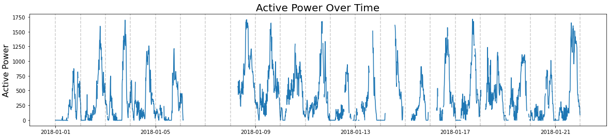
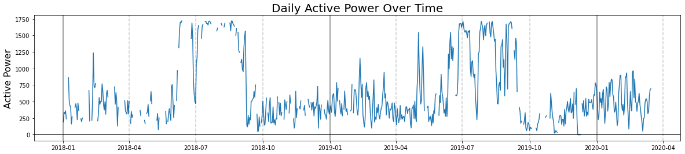
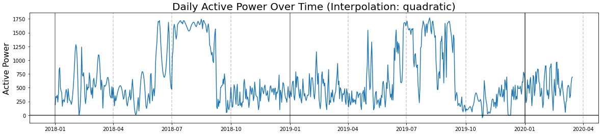
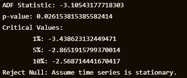
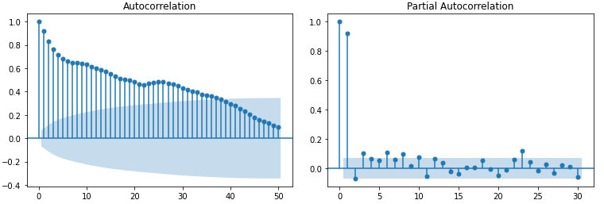
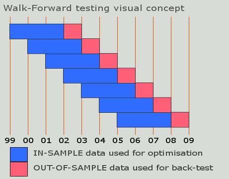
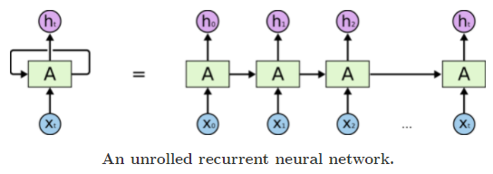
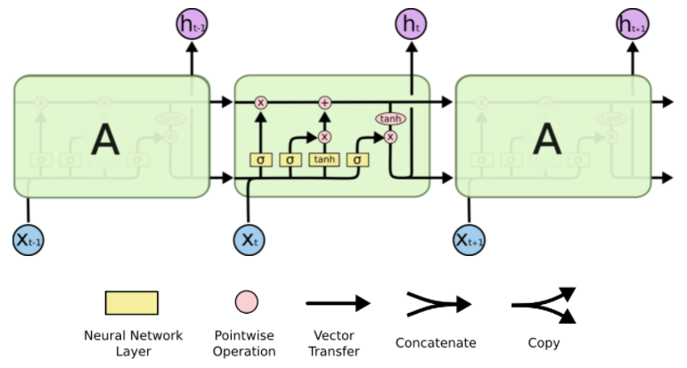
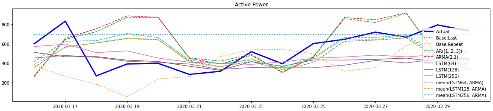
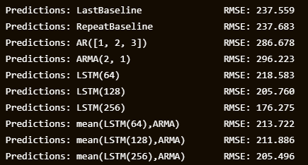

# WindPowerForecasting

We are given 2 years worth of observations of active power being generated by a windmill with observations recorded every 10 minutes. We would like to give a forecast for the next 15 days of active power.

## Data Exploration and Interpolation

A few days worth of readings show a clear daily seasonality.

    

One big problem with this time series is that ~20% of the data is missing. More so, the null observations come in large chunks, where there are often days worth of data missing, which would make interpolation a tricky task.

We choose to help mitigate this problem by downsampling the data. It is easier to interpolate if there are fewer missing data between readings. We make the decision to downsample to daily observations because our task is stated in terms of days, and because it is natural considering the daily seasonality. 

We aggregate the data per day using the mean function. This way, we can still easily calculate the amount of energy generated over time; active power is the change in energy over time, and we can approximate energy generated using a Riemann sum over the active power function (if we choose to do so). One potential problem with the mean aggregation is that it's possible that our only readings for a paticular day were at the high or low points of active power for that day. We define a day to be unreliable if there are more than 50 (out of 144) null readings per day. If so, we treat that day as missing data.

    

The data is then interpolated using a quadratic spline.

    

We apply the Automated Dickey-Fuller test to this new time series to see that it is stationary, although there is a clear yearly seasonality.

    

The Autocorrelation function (ACF) slowly decays while the Partial Autocorrelation function (PACF) drops off quickly. This suggests that an AutoRegressive (AR) model might work as a good model. 

    

## Autoregressive Models

An $AR(p)$ model is defined as
$$ X_t = \beta_0 + \beta_1 X_{t-1} + \dots + \beta_p X_{t-p} + \epsilon_t $$
where $X_i$ is the value of $X$ at time $i$, $\beta_j$ are the parameters, and $\epsilon_t$ is the error. In English, this says that the value of $X$ at any time $t$ is a constant plus some fixed linear combination of the values of $X$ at the previous $p$ time steps, within some level of error. 

We can find an appropriate value for $p$ by validating many different $AR(p_k)$ models against each other. We will tune the values of $\beta_i$ by a walk forward validation. The data is split into smaller chunks, and each chunk is split 5:1 into training and validation data. The training data for a chunk acts as a rolling window -- a model is trained on this data and the next ovbservation is predicted. This prediction is saved and fed back into the training data. The process repeats until the validation chunk has been exhausted. This simulates the process of updating a model as new information comes in.

    

A model is evaluated by recording the mean and variance of the RMSE for each validation chunk. We that the models generally perform the best when we use batches of size 45 days for our in-sample data. For this window size, an $AR(3)$ model maintains the lowest mean RMSE over the windows with a relatively low variance.

For fun, we also test for ARMA models. An ARMA model is simply a sum of an AR and an MA model. A Moving Average model $MA(q)$ is a regression 
$$
X_t = \mu + \theta_1 \epsilon_{t-1} + \dots + \theta_q \epsilon_{t-q} + \epsilon_t
$$
where $\epsilon_i$ is the error at time $t$ and the $\theta_i$ are the parameters. Intuitively, the model is modeling behavior which self-corrects to the mean $\mu$. 

An $ARMA(p,q)$ model is of the form $AR(p) + MA(q)$. We find that $ARMA(2,1)$ performs slightly better on the in-sample data. 

## Long Short-Term Memory Recurrent Neural Networks

A Long Short-Term Memory Recurrent Neural Network (LSTM) is a Recurrent neural network (RNN) that is designed to address the vanishing and exploding gradient problems of conventional RNNs. The $t+1$ th hidden state is defined like 
$$H_{t+1} = A(H_t, x_t)$$
where $x_t$ is the $t$ th point in the sequence and $A$ is some activation. 

    

This type of network suffers from short-term memory loss. This means that information passed through the system earlier in the sequence will contribute less to the output. If $t$ has a large range, then the activation $A$ is called many times recursively, which means the gradient will contain many products of $A$. An LSTM defines $A$ in a clever way so that the gradients are less likely to explode or vanish. 

    

As new information $x_t$ is inputted into (the bottom of) the system, it and the previous hidden state are passed through multiple gates which regulate the cell state (at the top). This allows for the inherent short-term memory of the RNN to be prolonged, as the system can choose to remember or forget specific bits of the sequence data along the way.

The dimension of the hidden states $h_t$ is a hyperparameter for the LSTM. We train three different LSTMs (using the same walk forward validation strategy as above) with hidden dimmensions 64, 128, and 256. 

## Results
We test each model on 15 days of fresh data. The models are evauated against two different baselines. The `LastBaseline` is defined by $X_t = X_{t-1}$ and the `RepeatBaseline` is defined by $X_t = X_{t-15}$. We also test ensembles of the ARMA model with the LSTM models.

    

    

We can see that the AR and ARMA models perform worse than the baseline models, but the LSTM models perform better with $LSTM(256)$ performing the best. The AR and ARMA models seem to be too sensitive to changes, while the LSTM may not be sensitive enough. Regardless, the ensembles aren't doing any favors for the RMSE scores, although it's possible they could perform better on a different test set. 

Further work should go into finding a better model. The next thing to do might be to try a more modern neural network architechture, such as a transformer. Facebook's Prophet might also be interesting to try. 
